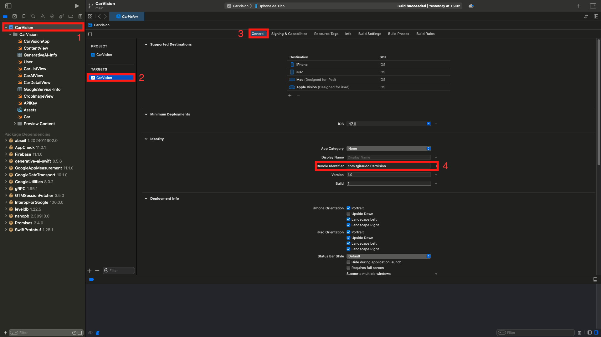

# CarVision


## Sumary
- [Description](#description)
- [Installation](#installation)

## Description
CarVision in an iOS app that let you take a picture of a car and thanks to Google AI Gemini gives you the brand, the model and so more.

## Instalation

### Clone the repository
```shell
git clone https://github.com/ThibaultGiraudon/CarVision.git
```

### Create .plist files:

- #### GenerativeAI-Info.plist:
On the project page tap `cmd + n`, choose `Propety List` and named it `GenerativeAI-Info.plist`.
Then inside this file add the key `API_KEY` and your gemini's api key as value.

> [!NOTE]
> *See [this page](https://aistudio.google.com/app/apikey) to get your own api key.*

- #### GoogleService.plist:
Go on [FireBase](https://console.firebase.google.com/) and create a new app with your Bundle Identifier.
You can get yours following those steps :



Than add a Storage and a Database. Don't forget to change the rules:

- ##### Storage:
```
rules_version = '2';


service firebase.storage {
  match /b/{bucket}/o {
    match /{allPaths=**} {
      allow read, write: if true;
    }
  }
}
```

- ##### Database:
```
rules_version = '2';

service cloud.firestore {
  match /databases/{database}/documents {
    match /{document=**} {
      allow read, write: if true;
    }
  }
}
```
## Features

### Cropping Images
See [here](https://medium.com/@thibault.giraudon/cropping-image-inswiftui-3214900f8666) a tutorial about how I made it.

### Google Gemini
```swift
enum APIKey {
	static var `default`: String {
		
		guard let filePath = Bundle.main.path(forResource: "GenerativeAI-Info", ofType: "plist")
		else {
			print("Couldn't find file 'GenerativeAI-Info.plist'.")
			return ""
		}
		
		let plist = NSDictionary(contentsOfFile: filePath)
		
		guard let value = plist?.object(forKey: "API_KEY") as? String else {
			print("Couldn't find key 'API_KEY' in 'GenerativeAI-Info.plist'.")
			return ""
		}
		
		if value.starts(with: "_") {
			print(
				"Follow the instructions at https://ai.google.dev/tutorials/setup to get an API key."
			)
			return ""
		}
		
		return value
	}
}
```
This enum get the API key from the plsit file we created before.

```swift
	@MainActor func analyze() {
		self.analyzedResult = nil
		self.isAnalyzing = true
		
		guard let uiImage = uiImage else {
			self.analyzedResult = "Image could not be loaded"
			self.isAnalyzing = false
			return
		}
		
		let prompt = "Provide a complete description of the car including the following details:\nCar brand.\nModel.\nHorsepower (hp).\nTop speed in km/h.\n0 to 100 km/h acceleration time in seconds.\nNumbre of cylinder.\nEngine displacement.\nEngine Layouts like flat-6.\nTurbo's architecture.\nColor code like Boston Green Metallic\nGive me each information with the unit in that order per line and nothing more"
		
		Task {
			do {
				let response = try await model.generateContent(prompt, uiImage)
				
				if let text = response.text {
					let components = text.split(separator: "\n")
					if components.count < 10 {
						self.analyzedResult = "Incorrect information provided"
						self.isAnalyzing = false
						return
					}
                    await uploadImage(uiImage)
                    let brand = components[0]
                    let model = components[1]
                    let horsepower = components[2]
                    let speed = components[3]
                    let acceleration = components[4]
                    let cylinders = components[5]
                    let displacement = components[6]
                    let architecture = components[7]
                    let turbo = components[8]
                    let colorName = components[9]
                    car = Car(brand: String(brand), model: String(model), horsepower: String(horsepower), speed: String(speed), acceleration: String(acceleration), colorName: String(colorName), displacement: String(displacement), cylinders: String(cylinders), architecture: String(architecture), turbo: String(turbo), imageURL: imageURL)
                    Task {
                        await user.loadImage(for: car)
                    }
					user.addCar(car)
				} else {
					self.analyzedResult = "No response from the model"
				}
			} catch {
				self.analyzedResult = "Error: \(error.localizedDescription)"
			}
			self.isAnalyzing = false
		}
	}
```
`analizedResult` contains a string depending on the error if ones occure.
`isAnalyzing` is a boolean to show a ProgressView while gemini is thinking.

### Manage Datas with Firebase Database
#### Add data
```swift
    let db = Firestore.firestore()

    func addCarToDB(car: Car) {
        let collectionRef = db
        
        do {
            try collectionRef.document("cars/\(car.id)").setData(from: car)
        } catch {
            print(error)
        }
    }
```
Nothing tricky here, I just set the document's name to the car's id.

#### Delete data
```swift
    func deleteCar(car: Car) async throws {
        do {
            try await deleteImage(car: car)
            try await db.document("cars/\(car.id)").delete()
            if let index = history.firstIndex(of: car) {
                history.remove(at: index)
            }
        } catch {
            print(error)
        }
    }
```
Again very easy because we can retrieve easly the document with the car's id.

#### Read data
```swift
    @MainActor
    func listenToItems() async {
        do {
            let snapshot = try await db.collection("cars").getDocuments()
            let docs = snapshot.documents
            let items = docs.compactMap {
                try? $0.data(as: Car.self)
            }
            
            self.history = items
        } catch {
            print("Error fetching items: \(error.localizedDescription)")
        }
    }
```
I get all the documents from the `cars` collection and store them into `Car` struct.
And saved the in the user's history.

### Manage Images with Firebase storage

#### Add images
```swift
    @MainActor
    func uploadImage(_ image: UIImage) async {
        do {
            
            let storage = Storage.storage()
            let storageRef = storage.reference()
            let new_id = UUID().uuidString
            let imageRef = storageRef.child("cars/\(new_id).jpg")
            
            let metadata = StorageMetadata()
            metadata.contentType = "image/jpeg"
            
            guard let data = image.pngData() else { return }
            
            _ = try await imageRef.putDataAsync(data, metadata: metadata)
            let downloadURL = try await imageRef.downloadURL()
            
            self.imageURL = downloadURL.absoluteString
        } catch {
            print(error.localizedDescription)
        }
    }
```
I create a new child and store the corresponding url in the new car item.

#### Delete image
```swift  
    func deleteImage(car: Car) async throws {
        do {
            try await Storage.storage().reference(forURL: car.imageURL).delete()
        } catch {
            print(error)
        }
    }
```
Once again nothing tricky.

#### Download images
```swift
class ViewModel: ObservableObject {
    @Published var image = UIImage()
    var imageURL: String
    
    init(imageURL: String) {
        self.imageURL = imageURL
    }
    
    func getImage() async -> UIImage? {
        if let image = await loadImage(from: URL(string: self.imageURL)!) {
            self.image = image
            return image
        }
        return nil
    }
    
    func loadImage(from url: URL) async -> UIImage? {
        do {
            let (data, _) = try await URLSession.shared.data(from: url)
            if let downloadedImage = UIImage(data: data) {
                return downloadedImage
            }
        } catch {
            print("Error downloading image: \(error)")
        }
        return nil
    }
}
```
This class load the image from the given url and store it in an UIImage.
The getImage func return an optionnal UIImage because Firebase database can't store UIImage and by setting it as optionnal it will be ignored.

```swift
    func loadImage(for car: Car) async {
        if let index = history.firstIndex(of: car) {
            let vm = ViewModel(imageURL: history[index].imageURL)
            let downloadedImage = await vm.getImage()
            
            DispatchQueue.main.async {
                self.history[index].image = downloadedImage
            }
        }
    }
```
I called this func on all car from the history to set the optionnal UIImage to the downloaded image.
```swift
.onAppear {
            Task {
                user.isListening = true
                await user.listenToItems()
                for car in user.history {
                    await user.loadImage(for: car)
                }
                user.isListening = false
            }
        }
```
I called it like that and the ContentView file.
I added a isListening boolean to display a ProgressView while the program is loading all the datas and images.
